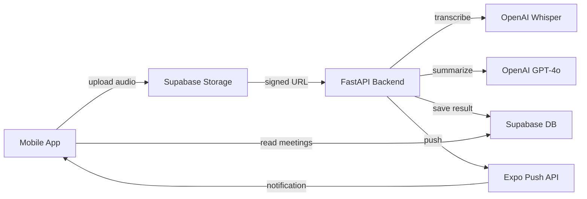

# MeetingNotes

A mobile app that records meetings, transcribes them using OpenAI Whisper, summarizes them with GPT-4o, and pushes the result back to your device.

> Full technical documentation → [WIKI.md](./WIKI.md)

---

## How to Run Locally

### Prerequisites

**General**
- Node.js 18+
- Python 3.9+
- Expo SDK 54 (`npx expo --version` should show `0.22.x`)
- [Expo account](https://expo.dev) + EAS CLI (`npm install -g eas-cli`)
- [Supabase](https://supabase.com) project with:
  - Postgres table `meetings` (see schema below)
  - Storage bucket `audio_meeting_notes` (private)
  - RLS policy allowing anon `SELECT` on `meetings`
- OpenAI API key (Whisper + GPT-4o access required)

**Android**
- Android Studio with a connected device or emulator
- Java 21 JDK (bundled with Android Studio)

**iOS** *(macOS only)*
- Xcode 15+
- Physical iOS device running iOS 16.2+ (Live Activities & push notifications don't work on simulator)

**Firebase (Push Notifications)**

Both files are **gitignored and must not be committed** — they contain sensitive project credentials.
Download them from the [Firebase Console](https://console.firebase.google.com) and place them manually:

| File | Location |
|---|---|
| `google-services.json` | `android/app/google-services.json` |
| `GoogleService-Info.plist` | `ios/MeetingNotes/GoogleService-Info.plist` |


#### Supabase `meetings` table schema

```sql
create table public.meetings (
  id          uuid        primary key,
  audio_url   text,
  push_token  text,
  status      text        default 'processing',
  transcript  text,
  summary     text,
  created_at  timestamptz default now()
);

-- Allow anonymous reads
create policy "anon can select meetings"
  on public.meetings for select to anon using (true);
```

### 1. Clone & install

```bash
git clone <repo-url>
cd MeetingNotes
npm install --legacy-peer-deps
```

### 2. Configure environment

**Frontend** — create `.env` in the project root:

```env
EXPO_PUBLIC_SUPABASE_URL=https://<project-ref>.supabase.co
EXPO_PUBLIC_SUPABASE_ANON_KEY=eyJ...
EXPO_PUBLIC_API_URL=http://<your-local-ip>:8000
```

> Use your machine's LAN IP (e.g. `192.168.1.x`), not `localhost`, so a physical device can reach the API.

**Backend** — create `backend/.env`:

```env
OPENAI_API_KEY=sk-...
SUPABASE_URL=https://<project-ref>.supabase.co
SUPABASE_SERVICE_ROLE_KEY=eyJ...
```

### 3. Run the backend

```bash
cd backend
python3 -m venv .venv
source .venv/bin/activate
pip install -r requirements.txt
python3 -m uvicorn main:app --reload --host 0.0.0.0 --port 8000
```

### 4. Run the mobile app

**Android:**

```bash
npx expo run:android
```

**iOS:**

```bash
npx expo run:ios --device
```

---

## Architecture Decisions



| Decision | Rationale |
|---|---|
| **FastAPI + background task** | Returns `202 Accepted` immediately; processing (transcription + summarization) happens async without blocking the client |
| **Supabase Storage for audio** | Avoids sending large audio files directly to the API; backend downloads via signed URL only when ready to process |
| **Push token as device identity** | No login required — each device is identified by its Expo push token, keeping the UX frictionless |
| **Custom Android foreground service** | `expo-av` doesn't support `staysActiveInBackground` on Android; a native Kotlin foreground service keeps the microphone alive when the app is backgrounded |
| **iOS Live Activities (ActivityKit)** | Surfaces recording controls (Pause/Resume/Stop) on the Dynamic Island and Lock Screen without the user needing to re-open the app |
| **Local AsyncStorage cache** | Meetings list loads instantly from cache on every app open; network response updates the cache in the background |

---

## What I'd Improve With More Time

**1. Chunked audio upload with retry**
Currently the full audio file is uploaded to Supabase Storage in a single request. A large file on a weak mobile connection will fail entirely if interrupted. The fix is multipart/chunked upload — split the file into smaller pieces, upload each independently, and retry only the failed chunks. A more ambitious variant is streaming chunks directly to the backend *during* recording, which would also enable real-time transcription.

**2. Authentication**
Device identity is tied to the Expo push token, which changes on reinstall or permission revoke — losing all previous meetings. Supabase Auth (even anonymous → upgrade to email/OAuth) would decouple identity from the token and let meetings persist across devices.

**3. Processing status via Realtime**
The only signal that processing is complete is a push notification. Adding a Supabase Realtime subscription on the `meetings` table would let the UI reflect status changes (`processing → completed`) live, without relying solely on push.

**4. Retry failed meetings**
If the backend fails mid-process (OpenAI timeout, network error), the meeting stays in `failed` status forever with no recovery path. A retry button on the detail screen — re-triggering `/process-meeting` with the existing audio URL — would make the UX recoverable.

**5. Tests**
There are no automated tests. The highest-value targets: `useRecording` hook logic (state machine), the `/process-meeting` endpoint (mocked OpenAI + Supabase), and the audio processor orchestration.

---
